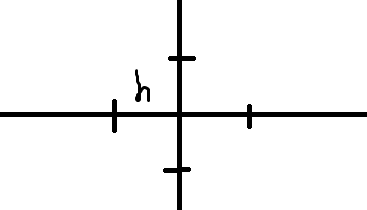
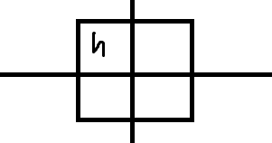

# 爬山演算法

算分數+搜尋，如果只有搜尋，那就是改良法

[ref](https://github.com/cccbook/py2cs/tree/master/03-%E4%BA%BA%E5%B7%A5%E6%99%BA%E6%85%A7/01-%E5%84%AA%E5%8C%96/01-%E7%88%AC%E5%B1%B1%E6%BC%94%E7%AE%97%E6%B3%95/02-%E9%9B%99%E8%AE%8A%E6%95%B8%E5%87%BD%E6%95%B8%E7%9A%84%E7%88%AC%E5%B1%B1)

使用上下左右進行爬山

```python
import random

def hillClimbing(f, x, y, h=0.01):
    while (True):
        fxy = f(x, y)
        print('x={0:.3f} y={1:.3f} f(x,y)={2:.3f}'.format(x, y, fxy))
        if f(x+h, y) >= fxy:
            x = x + h
        elif f(x-h, y) >= fxy:
            x = x - h
        elif f(x, y+h) >= fxy:
            y = y + h
        elif f(x, y-h) >= fxy:
            y = y - h
        else:
            break
    return (x,y,fxy)

def f(x, y):
    return -1 * ( x*x - 2*x + y*y + 2*y - 8 )

hillClimbing(f, 0, 0)
```



隨機爬山演算法會比方向性好用的多，因為不會漏掉其他的方向

```python
import random

def hillClimbing(f, x, y, h=0.01):
    failCount = 0                    # 失敗次數歸零
    while (failCount < 10000):       # 如果失敗次數小於一萬次就繼續執行
        fxy = f(x, y)                # fxy 為目前高度
        dx = random.uniform(-h, h)   # dx 為左右偏移量
        dy = random.uniform(-h, h)   # dy 為前後偏移量
        if f(x+dx, y+dy) >= fxy:     # 如果移動後高度比現在高
            x = x + dx               #   就移過去
            y = y + dy
            print('x={:.3f} y={:.3f} f(x,y)={:.3f}'.format(x, y, fxy))
            failCount = 0            # 失敗次數歸零
        else:                        # 若沒有更高
            failCount = failCount + 1#   那就又失敗一次
    return (x,y,fxy)                 # 結束傳回 （已經失敗超過一萬次了）

def f(x, y):
    return -1 * ( x*x -2*x + y*y +2*y - 8 )

hillClimbing(f, 0, 0)
```




在達到相同目的的效果上，參數越小越好，因為太多參數會 overfitting，而且參數小的泛用性會比較高


使用爬山尋找回歸線

```
```


# 模擬退火法

溫度越高，分子跳動越快，當溫度下降時，分子穩定不會亂跑，這個可以用在突破小山丘，不會像是爬山演算法到頂點就停了(就是在溫度高時，就算是答案較差也可能接受)，但是遇到大山丘也會跳不出去，除非時間拉很久，溫度又很高。而且模擬退火法的速度通常比爬山演算法還要慢

[ref](https://github.com/ccc111b/py2cs/tree/master/03-%E4%BA%BA%E5%B7%A5%E6%99%BA%E6%85%A7/01-%E5%84%AA%E5%8C%96/01-%E7%88%AC%E5%B1%B1%E6%BC%94%E7%AE%97%E6%B3%95/04-%E7%88%AC%E5%B1%B1%E7%89%A9%E4%BB%B6%E5%B0%8E%E5%90%91%E6%A1%86%E6%9E%B6)

> annealing.py

```python
import math
import random

def P(e, enew, T): # 模擬退火法的機率函數
    if (enew < e):
        return 1
    else:
        return math.exp((e-enew)/T)

def annealing(s, maxGens) : # 模擬退火法的主要函數
    sbest = s                              # sbest:到目前為止的最佳解
    ebest = s.energy()                     # ebest:到目前為止的最低能量
    T = 100                                # 從 100 度開始降溫
    for gens in range(maxGens):            # 迴圈，最多作 maxGens 這麼多代。
        snew = s.neighbor()                # 取得鄰居解
        e    = s.energy()                  # e    : 目前解的能量
        enew = snew.energy()               # enew : 鄰居解的能量
        T  = T * 0.995                     # 每次降低一些溫度
        if P(e, enew, T)>random.random():  # 根據溫度與能量差擲骰子，若通過
            s = snew                       # 則移動到新的鄰居解
            print("{} T={:.5f} {}".format(gens, T, s.str())) # 印出觀察

        if enew < ebest:                 # 如果新解的能量比最佳解好，則更新最佳解。
            sbest = snew
            ebest = enew
    
    print("solution: {}", sbest.str())     # 印出最佳解
    return sbest                           # 傳回最佳解
```

> solution.py

```python
class Solution: # 解答的物件模版 (類別)
    def __init__(self, v, step = 0.01):
        self.v = v       # 參數 v 為解答的資料結構
        self.step = step # 每一小步預設走的距離

    # 以下兩個函數至少需要覆蓋掉一個，否則會無窮遞迴
    def height(self): # 爬山演算法的高度函數
        return -1*self.energy()               # 高度 = -1 * 能量

    def energy(self): # 尋找最低點的能量函數
        return -1*self.height()               # 能量 = -1 * 高度
```

> solutionArray.py:

```python
from solution import Solution
from random import random, randint

class SolutionArray(Solution):
    def neighbor(self):           #  多變數解答的鄰居函數。
        nv = self.v.copy()        #  nv=v.clone()=目前解答的複製品
        i = randint(0, len(nv)-1) #  隨機選取一個變數
        if (random() > 0.5):      #  擲骰子決定要往左或往右移
            nv[i] += self.step
        else:
            nv[i] -= self.step
        return SolutionArray(nv)  #  傳回新建的鄰居解答。

    def energy(self): #  能量函數，要解的目標方程式
        x, y, z =self.v
        return x*x+3*y*y+z*z-4*x-3*y-5*z+8 #  (x^2+3y^2+z^2-4x-3y-5z+8)

    def str(self):    #  將解答轉為字串的函數，以供列印用。
        return "energy({:s})={:f}".format(str(self.v), self.energy())
```

