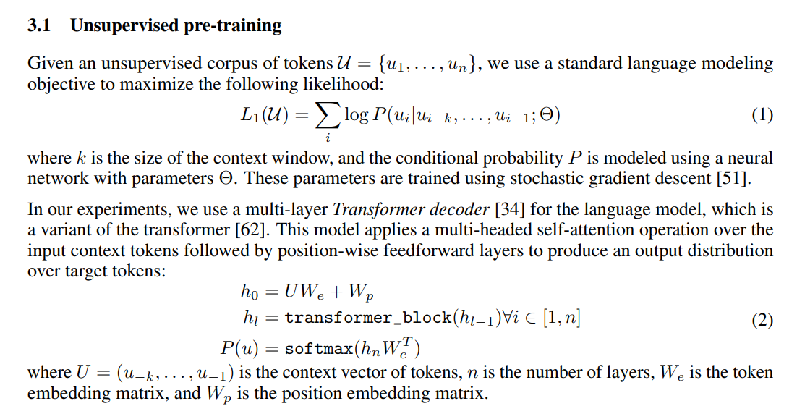
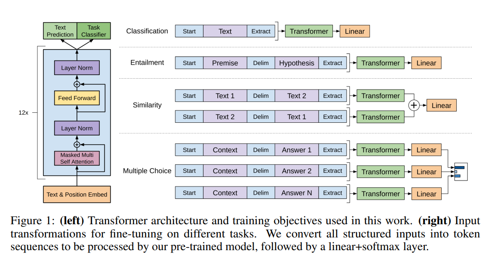

https://github.com/ccc111b/py2cs.git

語言越簡單越好，下面是一種通用可以表達簡單語句的語法

`S` = `NP VP` = `A*N* V A*N*`

現在可以使用ChatGPT幫我們抓裡面的內容，然後再根據這接詞的特性下去做分析


接下來我們回從最基本的語言模型基礎開始

現在語言模型不論多複雜，他其實本質還是馬可夫鏈


```
p(e|a) = 0.4   # p(e(後來)|a(初始))
p(a|a) = 0.6
p(a|e) = 0.7
p(e|e) = 0.3
可以寫成轉移矩陣:
     a    e
 a  0.6  0.4      =    M
 e  0.7  0.3
    
Ax = λx  (特徵值)

最後會收斂到特徵值，只要把特徵矩陣做N次方，就可以快速得到

M^n = λ^n E


```


[GPT1論文](https://s3-us-west-2.amazonaws.com/openai-assets/research-covers/language-unsupervised/language_understanding_paper.pdf): 



這邊最重要的就是馬可夫鏈 (1)，後面的Θ代表參數，現在這個參數都是好幾億，下面是馬可夫的範例

```
p(dog | a)  
p(chase | a dog)
p(a | a dog chase a)
p(cat | a dog chase a)   # cat -> 0.5, dog -> 0.2
```


在(2)的部分就是使用注意力機制，然後再使用softmax決定分類結果，這種方法可以有效推斷下一個詞是哪一個


這張是GPT最重要的圖，GPT可以fine-turn就是因為這個



classification: 分類

Entailment: 前提

Similarity: 相似度

Multiple Choice: 選擇問題


這些東西會使用監督式學習去學習，然後讓模型可以達到想要的功能


GPT使用transform 的一半，使用有Mask的部分，讓他可以判讀前後輸入內容


chatGPT就是在GPT上加上一層指導者的腳色，讓GPT可以更好的回答使用者問題


可以看minGPT範例更了解GPT: https://github.com/ccc111b/py2cs/blob/master/03-%E4%BA%BA%E5%B7%A5%E6%99%BA%E6%85%A7/05-%E6%B7%B1%E5%BA%A6%E5%AD%B8%E7%BF%92/06-gpt/01-mingpt/demo.ipynb


之前有sigmoid、relu...，目前gelu最常被使用，一個小窪地，讓梯度不會為0


[The Annotated Transformer (Attention is All You Need)](http://nlp.seas.harvard.edu/annotated-transformer/)

ref: https://github.com/ccc111b/py2cs/blob/master/_%E6%9B%B8/%E6%B7%B1%E5%BA%A6%E5%AD%B8%E7%BF%92/04b2-Attention%E7%9A%84%E5%AF%A6%E4%BD%9C.md

實作注意力機制

```python
import torch
import torch.nn as nn

class Attention(nn.Module):
    def __init__(self, hidden_dim):
        super(Attention, self).__init__()
        self.hidden_dim = hidden_dim
        self.attn_weights = nn.Linear(hidden_dim, 1, bias=False)
        self.W_q = nn.Linear(hidden_dim, hidden_dim, bias=False)
        self.W_k = nn.Linear(hidden_dim, hidden_dim, bias=False)
        self.W_v = nn.Linear(hidden_dim, hidden_dim, bias=False)
        
    def forward(self, encoder_outputs, hidden_state):
        # encoder_outputs: [batch_size, seq_len, hidden_dim]
        # hidden_state: [batch_size, hidden_dim]
        
        Q = self.W_q(hidden_state).unsqueeze(1)
        K = self.W_k(encoder_outputs)
        V = self.W_v(encoder_outputs)
        
        attn_scores = torch.matmul(Q, K.transpose(1, 2))
        attn_scores = torch.softmax(attn_scores, dim=-1)
        context = torch.matmul(attn_scores, V)
        context = context.squeeze(1)
        # context: [batch_size, hidden_dim]
        
        return context, attn_scores
```

hidden state 跟 encoder_outputs一樣: encode、hidden state 跟 encoder_outputs不一樣: decode


muti head

```python
import torch
import torch.nn as nn

class MultiHeadAttention(nn.Module):
    def __init__(self, hidden_dim, num_heads):
        super(MultiHeadAttention, self).__init__()
        self.hidden_dim = hidden_dim
        self.num_heads = num_heads
        self.head_dim = hidden_dim // num_heads
        
        self.W_q = nn.Linear(hidden_dim, hidden_dim, bias=False)
        self.W_k = nn.Linear(hidden_dim, hidden_dim, bias=False)
        self.W_v = nn.Linear(hidden_dim, hidden_dim, bias=False)
        self.W_o = nn.Linear(hidden_dim, hidden_dim, bias=False)
        
    def forward(self, encoder_outputs, hidden_state):
        # encoder_outputs: [batch_size, seq_len, hidden_dim]
        # hidden_state: [batch_size, hidden_dim]
        
        batch_size = encoder_outputs.size(0)
        
        Q = self.W_q(hidden_state).view(batch_size, -1, self.num_heads, self.head_dim).transpose(1, 2) 
        K = self.W_k(encoder_outputs).view(batch_size, -1, self.num_heads, self.head_dim).transpose(1, 2) 
        V = self.W_v(encoder_outputs).view(batch_size, -1, self.num_heads, self.head_dim).transpose(1, 2) 
        
        attn_scores = torch.matmul(Q, K.transpose(-2, -1)) / torch.sqrt(torch.tensor(self.head_dim, dtype=torch.float32))
        attn_scores = torch.softmax(attn_scores, dim=-1)
        
        context = torch.matmul(attn_scores, V)
        context = context.transpose(1, 2).contiguous().view(batch_size, -1, self.hidden_dim)
        
        output = self.W_o(context)
        
        return output, attn_scores
```

