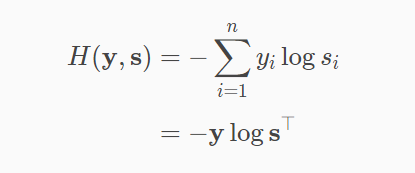
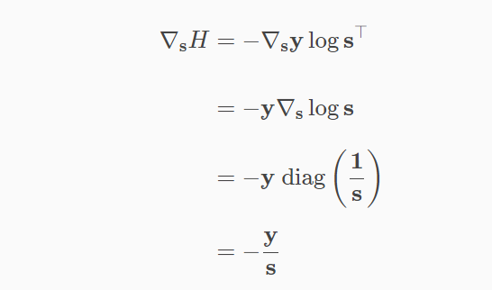
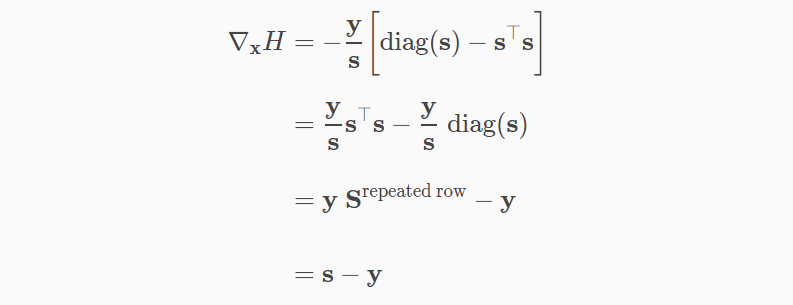

ref: 

* https://github.com/ccc111b/py2cs
* https://mattpetersen.github.io/softmax-with-cross-entropy
* https://github.com/cccbook/py2gpt/wiki

`py2cs/03-人工智慧/機器學習/sklearn/03-classifierFramework`


這禮拜主要學習機器學習，使用scikit-learn學，裡面一共分為三類: Classification(分類問題，自己定義類別)、Regression(連續問題，像是預測股票)、Clustering(分類問題，讓電腦自己分群)


裡面還有一些技巧性的方法: Dimensionality reduce(資料降維)、model selection(比較模型)、Preprocessing(資料預處裡)


iris(鳶尾花)是scikit-learing最具代表性的資料集，透過使用者輸入的花辮花萼的數據，來分辨是哪種類別的鳶尾花

> 01-classifyData/iris_dump.py: 顯示iris資料庫

```python
from sklearn import datasets

iris = datasets.load_iris()
# print(iris)
print('iris.keys()=', iris.keys())
print('filename=', iris.filename) # 特徵屬性的名稱
print('feature_names=', iris.feature_names) # 特徵屬性的名稱
print('data=', iris.data) # data 是一個 numpy 2d array, 通常用 X 代表
print('target=', iris.target) # target 目標值，答案，通常用 y 代表
print('target_names=', iris.target_names) # 目標屬性的名稱
print('DESCR=', iris.DESCR)

import pandas as pd

x = pd.DataFrame(iris.data, columns=iris.feature_names)
print('x=', x)
y = pd.DataFrame(iris.target, columns=['target'])
print('y=', y)
data = pd.concat([x,y], axis=1) # 水平合併 x | y
# axis 若為 0 代表垂直合併  x/y (x over y)
print('data=\n', data)
data.to_csv('iris_dump.csv', index=False)
```


> 01-classifyData/iris_load.py: 讀取剛剛dump出來的鳶尾花資料的CSV檔

```python
import pandas as pd

data= pd.read_csv('./iris_dump.csv')
print('data=\n', data)

x = data.drop(labels=['target'],axis=1).values # 垂直欄 target 去掉
print('x=', x)

y = data['target']
print('y=', y)
```


> 03-classifierFramework/main.py: 使用不同的分類方法分類鳶尾花資料

```python
import ml
# 要使用哪一個就把目前的註解掉，然後再開啟想要用的
#  x_train,x_test,y_train,y_test=ml.load_csv('../csv/cmc.csv', 'ContraceptiveMethodUsed')
# 這裡直接分訓練集8成，測試集2成
x_train,x_test,y_train,y_test=ml.load_csv('../csv/iris.csv', 'target')
# from decision_tree_classifier import train_classifier
# from mlp_classifier import learn_classifier
# from sgd_classifier import learn_classifier
# from gnb_classifier import learn_classifier
from knn_classifier import learn_classifier
# from svm_classifier import learn_classifier
# from ovr_classifier import learn_classifier
# from random_forest_classifier import learn_classifier
classifier = learn_classifier(x_train, y_train)
print('=========== train report ==========')
ml.report(classifier, x_train, y_train)  # 報告訓練集
print('=========== test report ==========')
ml.report(classifier, x_test, y_test)  # 會映出混淆矩陣
```

TN: 預測資料正確，實際資料也正確

TP: 預測資料正確，實際資料不正確

FN: 預測資料不正確，實際資料正確

TP: 預測資料不正確，實際資料也不正確

* precisionPrecision = `TP / (TP + FP)`，對預測結果而言的，所有被預測為正的樣本中實際為正的樣本的概率。就是在預測為正樣本的結果中，我們有多少把握可以預測正確
* Recall(FPR) = `TP / (TP + FN)`，對原樣本而言的，實際為正的樣本中被預測為正樣本的概率。含意類似於: 寧可錯殺一千，絕不放過一個
* f1-score = `2 * (Precision + Recall) / (Precision+Recall)`，Precision和Recall是既矛盾又統一的兩個指標， 為了提高Precision值，分類器需要儘量在“更有把握”時才把樣本預測為正樣本，但此時往往會因為過於保守而漏掉很多“沒有把握”的正樣本，導致Recall值降低。F1 Score就是為了這個問提而誕生的平衡點
* accuracy = `(TP+TN) / (TP+TN+FP+TN)`，資料準確度


舉個例子

```sh
# 混淆矩陣
[[ 8  0  0]
 [ 0 11  1]
 [ 0  0 10]]
 
accuracy: 0.97  # (30-1)/30
       precision recall  f1-score
0      1.00      1.00    1.00
1      1.00      0.92    0.96
2      0.91      1.00    0.95
#  0 1 2 代表各個類別
# precision: 8/8, 11/11, (10/10+1)
# recall: 8/8, (11/11+1), 10/10
# f1-score: 2*1/(1+1), 2*(1+0.92)/(1+0.92), 2*(0.91+1)/(0.91+1)

```


通常上面的分類方法的損失函數都是使用Cross-Entropy (交叉熵)，在最後一層加上下面的程式碼

```python
def loss(y, x)  # 正向傳遞
	s = softmax(x)
	return cross_entopy(y, s)
```

Cross_Entropy的運算式，最後要越小越好



Cross_Entropy的微分為下面的形式



所以寫成程式碼就會長這樣

```python
def gradient_cross_entropy(y, s):
    """Return the gradient of cross-entropy of vectors y and s.

    :type y: ndarray
    :param y: one-hot vector encoding correct class

    :type s: ndarray
    :param s: softmax vector

    :returns: ndarray of size len(s)
    """
    return -y / s
```


而cross_entropy + softmax(exp/sum(exp))的梯度則是如下:



```python
def error_softmax_input(y, s):
    """Return the sensitivity of cross-entropy cost to input of softmax.

    :type y: ndarray
    :param y: one-hot vector encoding correct class

    :type s: ndarray
    :param s: softmax vector

    :returns: ndarray of size len(s)
    """
    return s - y
```


> [test01.py](https://github.com/cccbook/py2gpt/blob/master/03-backprop/02-softmax/test1.py): 測試softmax

```python
import numgd as ngd
import soft as so
import numpy as np

x = np.array([0.3, 0.5, 0.2])
y = np.array([0.0, 1.0, 0.0])
print('x =', x)
print('y =', y)

s = so.softmax(x)
print('s = softmax(x) =', s)

print('jacobian_softmax(s)=\n', so.jacobian_softmax(s))
print('cross_entropy(y, s)=', so.cross_entropy(y, s))

def num_gradient_cross_entropy(y, s):
    return ngd.grad(lambda s:so.cross_entropy(y, s), s)

print('    gradient_cross_entropy(y, s)=', so.gradient_cross_entropy(y, s))
print('num_gradient_cross_entropy(y, s)=', num_gradient_cross_entropy(y, s))

def loss(y, x):
    s = so.softmax(x)
    return so.cross_entropy(y, s)

def num_error_softmax_input(y, x):
    return ngd.grad(lambda x:loss(y, x), x)

print('    error_softmax_input(y, s)=', so.error_softmax_input(y, s))  # 驗證公式
print('num_error_softmax_input(y, x)=', num_error_softmax_input(y, x))
```


而regression是使用LSM(最小平方法)當作損失函數


> [mnist.py](https://github.com/cccbook/py2gpt/blob/master/03b-MacroGrad/mnist.py): 使用整個矩陣做反傳遞算法

```python
from macrograd import Tensor

from keras.datasets import mnist
import keras
import numpy as np

(x_train, y_train), (x_test, y_test) = mnist.load_data()
train_images = np.asarray(x_train, dtype=np.float32) / 255.0
test_images = np.asarray(x_test, dtype=np.float32) / 255.0
train_images = train_images.reshape(60000, 784)
test_images = test_images.reshape(10000, 784)
y_train = keras.utils.to_categorical(y_train)

def forward(X,Y,W):
    y_predW = X.matmul(W)
    probs = y_predW.softmax()
    loss = probs.cross_entropy(Y)
    return loss

batch_size = 32
steps = 20000

X = Tensor(train_images); Y = Tensor(y_train) # 全部資料
# new initialized weights for gradient descent
Wb = Tensor(np.random.randn(784, 10))
for step in range(steps):
    ri = np.random.permutation(train_images.shape[0])[:batch_size]
    Xb, yb = Tensor(train_images[ri]), Tensor(y_train[ri]) # Batch 資料
    lossb = forward(Xb, yb, Wb)  # cross entropy
    lossb.backward()
    if step % 1000 == 0 or step == steps-1:
        loss = forward(X, Y, Wb).data/X.data.shape[0]
        print(f'loss in step {step} is {loss}')
    Wb.data = Wb.data - 0.01*Wb.grad # update weights, 相當於 optimizer.step()
    Wb.grad = 0  # 梯度歸0
```


機器學習分群cluster

> 04-clusterData/cluster_data1.py:產生分群的資料

```python
import matplotlib.pyplot as plt
import numpy as np
from sklearn import datasets
n = 300
X, y = datasets.make_blobs(n_samples=n, centers=4, cluster_std=0.60, random_state=0)
# X, y = datasets.make_moons(n_samples=n, noise=0.1)
# X, y = datasets.make_circles(n_samples=n, noise=0.1, factor=0.5)
# X, y = np.random.rand(n, 2), None
plt.scatter(X[:, 0], X[:, 1]) # , s=50
plt.show()
```


分群程式碼: https://scikit-learn.org/stable/auto_examples/cluster/plot_cluster_comparison.html


> 05-cluster/cluster1.py: 使用分群程式碼，選擇想要使用的model

```python
# https://ithelp.ithome.com.tw/articles/10207518
import matplotlib.pyplot as plt
import numpy as np
from sklearn import datasets, cluster

# n=300
n = 500
# X, y = datasets.make_blobs(n_samples=n, centers=3, cluster_std=0.60, random_state=0)
# X, y = datasets.make_moons(n_samples=n, noise=0.05)   
X, y = datasets.make_circles(n_samples=n, factor=0.5, noise=0.05)  # 隨機產生環狀資料分布
# X, y = np.random.rand(n, 2), None  # 隨機產生資料
# y 代表該點屬於哪一群，分群時沒用到

# plt.scatter(X[:, 0], X[:, 1], c=y) # , s=50
plt.scatter(X[:, 0], X[:, 1]) # , s=50
plt.show()

# 假設我們希望將資料分成 3 個 cluster
# model = cluster.KMeans(n_clusters=3) # K-mean使用相對距離作分群，所以使用月彎形(make_moons)或是圓形(make_circles)的效果會不太好
# model = cluster.KMeans(n_clusters=2)
# model = cluster.AgglomerativeClustering(n_clusters=3)
# model = cluster.DBSCAN(eps=0.5, min_samples=3) # 對 circle 不好
model = cluster.DBSCAN(eps=0.3) # 對 circle 不好
# model = cluster.SpectralClustering(n_clusters=3)
# model = cluster.SpectralClustering(n_clusters=2)
# model = cluster.AffinityPropagation(damping=0.5, max_iter=200)

# 將資料集放入模型中進行訓練
model.fit(X)

# 透過模型對每個樣本進行預測，得到每個樣本所屬的 cluster
predictions = model.predict(X)
# predictions = model.fit_predict(X)
# 繪製散佈圖
plt.scatter(X[:, 0], X[:, 1], c=predictions)
plt.show()

```


接下來是機器學習regression

> 06-regression/linear1.py: 簡單的linear model 測試

```python
import matplotlib.pyplot as plt
from sklearn import linear_model
reg = linear_model.LinearRegression()
x = [[1], [2], [3]]
y = [3.0, 5.0, 7.0] # y = [3.1, 5.0, 7.1]
reg.fit(x, y)
print('c0=', reg.predict([[0.0]]))
print('c=', reg.coef_)
y_predicted = reg.predict(x)
plt.plot(x, y, 'ro', label='Original data')
plt.plot(x, y_predicted, label='Fitted line')
plt.legend()
plt.show()
```

